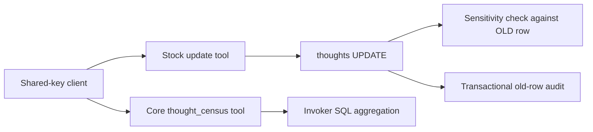

# Guarded Thought Updates and Census



## What it does

Adds transactional audit and sensitivity checks to every ordinary update of an Open Brain
thought, including direct SQL. Adds a named read-only `thought_census` tool to this fork's core
MCP server. The separate stock update integration remains unchanged.

This companion builds on Nate B. Jones's [Open Brain](../../docs/01-getting-started.md) and
Scott Hutchinson's [Thought Audit schema](../thought-audit/README.md). More practical systems:
[Nate's newsletter](https://substack.com/@natesnewsletter) and [site](https://natebjones.com).

## Prerequisites

- Working core schema, including an enabled `thoughts_updated_at` trigger.
- A reviewed backup of the entire public schema and data, with restore evidence.
- A privileged migration connection; `service_role`, `anon`, and `authenticated` roles.
- The unmodified `schemas/thought-audit/schema.sql` dependency at the reviewed source pin.
- An independent review before applying the bundle to real data or registering update clients.

## Step-by-step instructions

1. Read current grants, triggers, function definitions, row counts and source versions. Save them
   privately for rollback. An already deployed update endpoint is callable by any shared-key holder;
   omitting it from a connector list does not disable it. Coordinate the cutover with those writers.
2. Assemble **one transactional migration** in a private deployment workspace: begin transaction,
   set the local search path to `public`, set a short lock timeout, lock `public.thoughts` against
   concurrent writes, include the pinned audit schema unchanged, include this `schema.sql`, commit.
   Both SQL files must run in the same transaction. Preserve the existing updated-at function and
   trigger rather than recreating or replacing them. This layer checks the enabled-trigger prerequisite.
3. Test the bundle on an empty disposable database first. `tests.sql` requires artificial empty
   tables and rolls back its fixtures. Example using a disposable connection stored in an environment
   variable, from the repository root:

   ```sh
   psql "$TEST_DATABASE_URL" -X -v ON_ERROR_STOP=1 --single-transaction \
     -f schemas/thought-audit/schema.sql -f schemas/guarded-thought-updates/schema.sql
   psql "$TEST_DATABASE_URL" -X -v ON_ERROR_STOP=1 -f schemas/guarded-thought-updates/tests.sql
   cd server
   deno test --allow-env --no-lock --node-modules-dir=none census.test.ts
   ```

4. After independent review and a fresh verified backup, apply the reviewed migration once through
   the deployment's migration mechanism. It is intentionally not rerunnable: duplicate function or
   trigger names abort the transaction instead of silently overwriting another installation.
5. Read back grants, triggers, audit definitions, the invoker census, and unchanged thought counts.
   Deploy the reviewed core MCP source; keep stock update source byte-for-byte pinned.
6. Exercise controlled update, denied downgrade, anon denial, and an operator-authorized scoped
   delete against artificial live verification records; check their audit rows. Compare census with
   independent SQL totals. Only then register update clients. There is no delete MCP tool.

## Expected outcome

`thought_census({key: "sensitivity", filter: {project: "example"}})` returns a JSON value:

```json
{"key":"sensitivity","filter":{"project":"example"},"total":3,"groups":{"internal":2,"(none)":1}}
```

This is SQL aggregation across the selected population, without a REST row limit. The key is a
text value, never executable SQL. Filters use JSONB containment (include-only, including nested
objects); SQL-null metadata is excluded by containment. Missing and JSON-null key values share
`(none)`. A literal metadata value `(none)` shares that bucket too. Values of other JSON types use
PostgreSQL's text representation. Results represent the calling statement's snapshot, not a frozen
population across multiple tool calls. High-cardinality keys can produce large JSON responses.

Audit records copy `to_jsonb(OLD) - 'embedding'` before UPDATE or DELETE. Audit failure aborts the
mutation. INSERT/capture has no audit trigger. The new audit table permits service-role SELECT and
INSERT, but not UPDATE, DELETE or truncation; ownership still permits privileged maintenance.
`source` and `author_session_id` describe the OLD record and are not authenticated caller identity.

Sensitivity order is `open < internal < confidential < restricted`; removing a key or setting it to
null is a downgrade, including from `open`. A downgrade requires exactly:

```json
{"declassified":{"from":"restricted","to":"internal","reason":"Approved example release","at":"2026-01-01T00:00:00Z"}}
```

`from` must equal the OLD tier at the actual database write, `to` must equal the new tier (JSON
null for removal), `reason` must be a nonblank string, and `at` a valid ISO timestamp with offset.
The declaration stays on the thought. Legacy null/missing OLD tiers never block updates; unknown
tagged tiers must remain unchanged until their repair is explicitly reviewed. No session-variable
bypass exists. A declaration records intent; shared-key possession does not prove human approval.

## Rollback

On any failure before commit the entire bundle rolls back. After commit, stop and obtain the
operator's rollback decision before weakening protections. Prefer retaining guards and audit while
rolling back only the core census tool, if the defect is in that tool.

Remove the census trigger-independent function with `DROP FUNCTION public.thought_census(text,jsonb);`
and redeploy the previous core artifact. Removing the two new triggers and their trigger functions
restores the prior update behavior; keep the existing `thoughts_updated_at` trigger. Restore the
**actual saved** anon grants, including grant options and any column-level grants. Do not guess a
grant list. Keep the audit table and captured history protected unless it has been separately
exported and the operator explicitly requests full structural restoration. Rebuild a deleted row's
embedding from captured content or use a verified full backup; the audit intentionally omits it.
Notify PostgREST to reload its schema after function changes. Re-read counts and versions.

## Troubleshooting and limitations

- `GUARD_PREREQUISITE`: inspect the core updated-at trigger before applying anything; do not bypass
  the prerequisite. Install the dependency and this layer in the same transaction.
- `SENSITIVITY_DOWNGRADE`: retrieve the current record through `fetch(id)` to obtain `updated_at`
  and metadata, then request an explicit valid declaration. The stock tool returns `isError: true`
  and `update_thought error: SENSITIVITY_DOWNGRADE: ...`; this differs from `STALE_READ: ...`.
- `permission denied`: verify the calling role and grants. Anon is intentionally denied on thoughts
  and census. Audit definer privileges belong to the migration owner, not to API clients.
- The stock stale-read check and update are separate statements, so a concurrent write can still be
  overwritten. The database downgrade guard uses the real OLD row, but it is not compare-and-swap.
- Stock content updates do not refresh `content_fingerprint`. Review dedup consequences separately;
  this bundle does not change the pinned update integration or repair existing records.
- Existing `authenticated` grants on thoughts are unchanged by the ruled anon-only revocation.
  Table owners can disable triggers; privileged maintenance is outside the ordinary-write guarantee.
- Upstream audit comments originally describe best-effort application logging. This layer overrides
  the table/diff comments to describe transactional old-row history, without editing upstream SQL.
